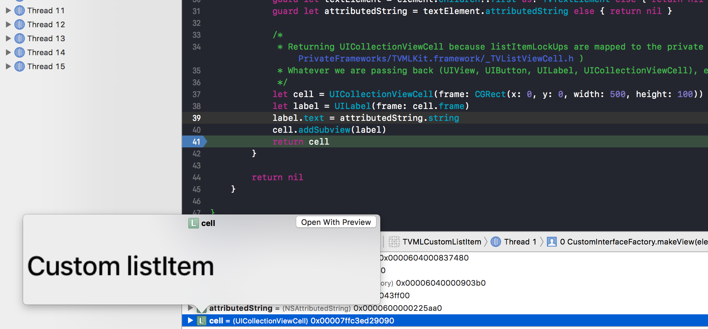
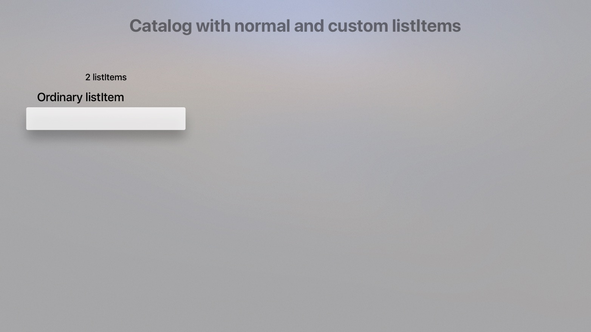

# Radar-34055392

Project created to report bug on Custom TVML listItemLockup elements

· Open radar: https://openradar.appspot.com/34055392

# Description
When using a [catalogTemplate](https://developer.apple.com/library/content/documentation/LanguagesUtilities/Conceptual/ATV_Template_Guide/CatalogTemplate.html) for TVML, no customization via the `TVInterfaceFactory.shared().extendedInterfaceCreator` can be achieved. It falls back to an empty `TVListViewCell`.

# Expected 
Overriding the function `override func makeView(element: TVViewElement, existingView: UIView?) -> UIView? {` in `TVInterfaceFactory` should be also available to `listItems`

# Steps

Running the app and selecting the first button "Open List Item View" opens a catalog template with the custom listItem element that can't be customized.

# Environment

- Xcode Version 9.0 beta 4 (9M189t)
- tvOS 11.0 (15J5333e)
